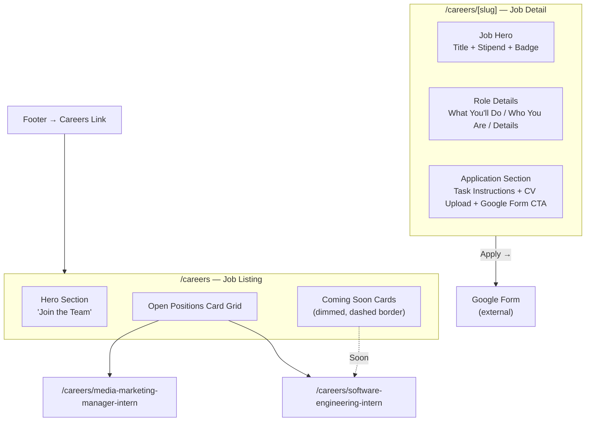

# Careers Page — Job Listing + Detail Pages Plan

## Overview

Transform the current single-job `/careers` page into a **job listing page** with multiple job cards, each linking to a dedicated detail page at `/careers/[slug]`. Replace "no cover letter" language with CV/resume-based application wording. Add 2-3 "Coming Soon" placeholder cards to signal growth.

---

## Current State Analysis

| Item | Current | Target |
|------|---------|--------|
| [`/careers`](landing-page/src/app/careers/page.tsx) | Single job detail for "Media Marketing Manager Intern" | Job listing page with cards |
| Job detail pages | None | `/careers/[slug]` for each job |
| Application text | "No cover letter needed. Just the task." | Change to CV/resume-based wording |
| [`constants.ts`](landing-page/src/app/constants.ts) | `CAREERS.mediaManagerForm` only | `CAREERS` becomes a jobs array with full job data |
| [`Footer.tsx`](landing-page/src/components/Footer.tsx) | Already links to `/careers` | No change needed |

---

## Files to Create/Modify

### 1. [`landing-page/src/app/constants.ts`](landing-page/src/app/constants.ts) — Restructure careers data

**Change:** Replace the flat `CAREERS` object with a structured `JOBS` array containing job definitions.

```ts
export const CAREERS = {
  mediaManagerForm:
    "https://docs.google.com/forms/d/e/YOUR_GOOGLE_FORM_ID/viewform",
} as const;

// ── Job Listings ──
export interface Job {
  slug: string;
  title: string;
  location: string;
  type: "Full-time" | "Internship" | "Contract";
  department: string;
  stipend?: string;
  salary?: string;
  publishedAt: string; // ISO date string
  status: "open" | "coming_soon";
  description: string;
  details: Array<{ title: string; items: string[] }>;
  formUrl?: string;
}

export const JOBS: Job[] = [
  {
    slug: "media-marketing-manager-intern",
    title: "Media Marketing Manager Intern",
    location: "Remote",
    type: "Internship",
    department: "Marketing",
    stipend: "₹5,000 / month",
    publishedAt: "2026-07-01",
    status: "open",
    description:
      "Own Cookd's social media presence across TikTok, Instagram Reels, and Twitter/X. Create viral hooks and grow organic reach among Gen Z/Millennial messaging app users.",
    details: [
      // same role details as current page
    ],
    formUrl: CAREERS.mediaManagerForm,
  },
  {
    slug: "software-engineering-intern",
    title: "Software Engineering Intern",
    location: "Remote",
    type: "Internship",
    department: "Engineering",
    stipend: "₹10,000 / month",
    publishedAt: "",
    status: "coming_soon",
    description:
      "Build and scale the AI-powered features that make Cookd magical. Work on real production systems from day one.",
    details: [
      {
        title: "What You'll Do",
        items: [
          "Build and maintain backend APIs in Python/FastAPI",
          "Contribute to our AI/ML pipeline for conversation analysis",
          "Write clean, tested, well-documented code",
        ],
      },
      {
        title: "Who You Are",
        items: [
          "Proficient in Python and familiar with async programming",
          "Comfortable with SQL and database design",
          "Excited about AI/ML applications in consumer products",
        ],
      },
      {
        title: "Details",
        items: [
          "Stipend: ₹10,000 / month",
          "Duration: 3 months (renewable)",
          "Location: Remote",
          "Start date: TBD",
        ],
      },
    ],
  },
  // Add 1-2 more coming_soon entries...
];
```

### 2. [`landing-page/src/app/careers/page.tsx`](landing-page/src/app/careers/page.tsx) — Transform to job listing

**Change:** Rewrite the page as a **listing view** with:

- **Hero section** (simplified) — "Join the Team" heading + tagline
- **Open Positions section** — grid of job cards for `status: "open"` jobs
- **Coming Soon section** — visually dimmed/dashed-border cards for `status: "coming_soon"` jobs
- Each card shows: title, department, location, type, stipend/salary, brief description, and a "View Role →" or "Coming Soon" button
- **Remove** the detailed role sections, task-based application, and Google Form CTA from this page (they move to the detail page)

**Design patterns** to reuse from existing codebase:
- Grid pattern background from [`contact page`](landing-page/src/app/contact/page.tsx) (lines 63-69)
- `AnimatedSection` from [`Animations.tsx`](landing-page/src/components/Animations.tsx)
- `motion` framer-mocard animations
- Same `EASE_OUT` bezier curve

### 3. Create [`landing-page/src/app/careers/[slug]/page.tsx`](landing-page/src/app/careers/[slug]/page.tsx) — Job detail page

**New file — Dynamic route** that:

- Uses `params.slug` to look up the job from `JOBS` array
- Renders the **full job detail** (the content currently on the careers page) — hero with job title, role details sections, application section
- Shows "Apply Now" CTA with CV/submit wording
- If `status === "coming_soon"`, show a "Coming Soon" badge and disable the apply button
- Handles 404 gracefully if slug doesn't match any job

**Key:** Move the current hero + role details + application sections from the listing page into this detail page.

### 4. Wording Change — "CV" / "Resume" everywhere

Replace these phrases in both [`page.tsx`](landing-page/src/app/careers/page.tsx) and the new [`[slug]/page.tsx`](landing-page/src/app/careers/[slug]/page.tsx):

| Current Text | New Text |
|-------------|----------|
| "No cover letter required" / "No cover letter needed" | "Submit your CV along with the task" |
| "No cover letter needed. Just the task." | "Upload your CV so we can get to know you better." |
| Description text about "no cover letters" | Adjust to mention CV submission + task |

---

## Architecture Diagram



---

## Execution Order

1. **Update [`constants.ts`](landing-page/src/app/constants.ts)** — Define `Job` interface and `JOBS` array with all jobs (including 2-3 "coming_soon" entries). Keep `CAREERS.mediaManagerForm` reference.
2. **Rewrite [`careers/page.tsx`](landing-page/src/app/careers/page.tsx)** — Convert to listing page with job cards.
3. **Create [`careers/[slug]/page.tsx`](landing-page/src/app/careers/[slug]/page.tsx)** — Dynamic detail page.
4. **Update Footer** (verify — already has `/careers` link, likely no change needed).
5. **Verify build** — `cd landing-page && npm run build` to catch any type errors.

---

## Design Considerations

- **Job cards** follow the same visual language: `border-nothing-border`, `bg-nothing-black/30`, rounded-xl
- **Coming Soon cards** use dashed borders (`border-dashed border-nothing-border/50`) and reduced opacity to visually distinguish
- **Responsive grid**: 1 column on mobile, 2 on `md`, 3 on `lg`
- **PostHog tracking** on card clicks and apply button clicks (matching existing pattern)
- **SEO**: Each job detail page gets a unique `<title>` and `<meta description>`
