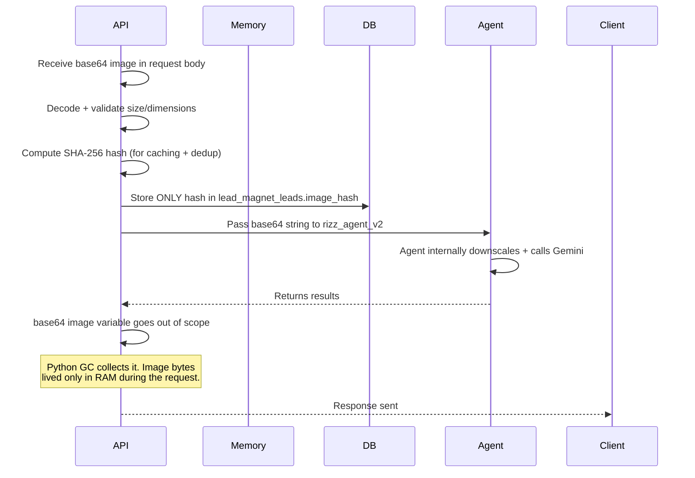
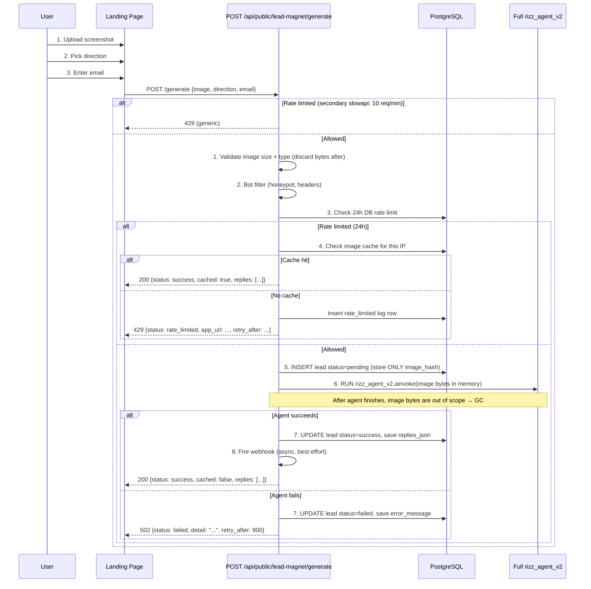
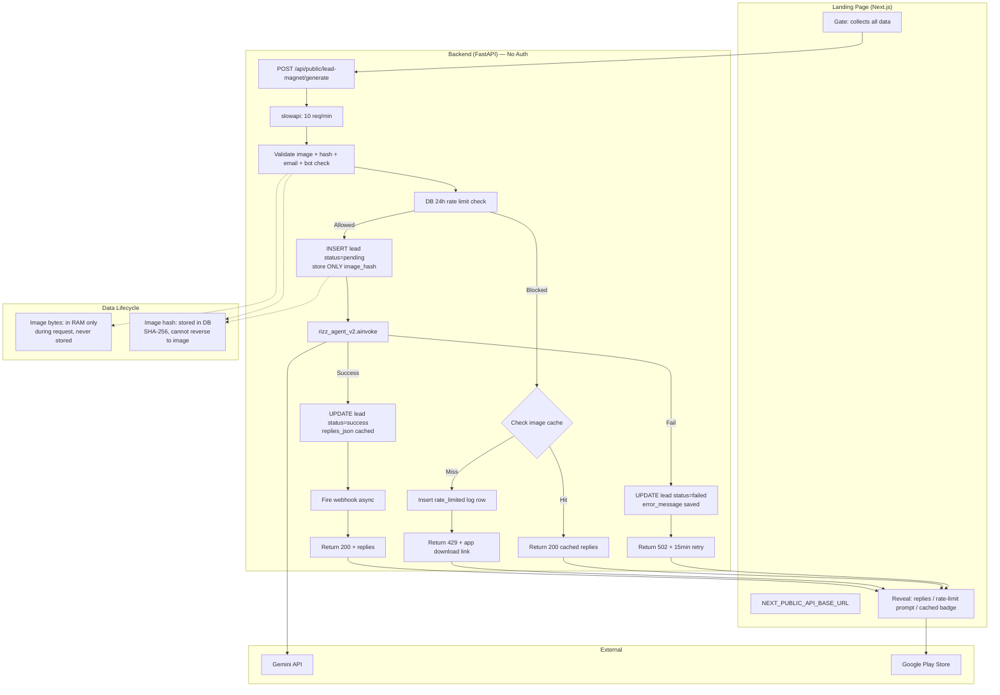

# Public Lead-Magnet API — Architecture & Implementation Plan

## 1. Overview

A **public (no-auth-required) API** that powers the interactive hero lead-magnet flow on the landing page. It runs the **full v2 agent** (`rizz_agent_v2`) so users see the real capability instead of generic mock replies.

**Key constraints:**

- **1 request per 24 hours per IP** — hard limit to control costs, with exceptions for failure/short-circuit
- **Gemini called after email submit** — no wasted cost
- **Lead inserted first** → generate → **update lead with status** (pending → success/failed)
- **Same-image caching** — if user retries same image within their 24h window, return cached result
- **DB-backed rate limiting** — no Redis needed for a 24h window (single indexed query)
- **Images are NEVER stored in DB or disk** — only a SHA-256 hash is saved, image bytes are discarded immediately after the agent run

---

## 2. Lead Status Lifecycle

Each attempt creates a lead row that transitions through statuses:

```
User submits
    │
    ▼
rate_limited ── (if already rate limited AND no cache hit)
    │
pending ── (inserted before agent runs)
    │
    ├──→ success ── (agent completed, replies returned)
    │
    └──→ failed ── (agent threw error)
```

### What Each Status Means for Rate Limiting

| Status              | Consumes 24h Window?             | Notes                                               |
| ------------------- | -------------------------------- | --------------------------------------------------- |
| `success`           | ✅ Yes                           | Full usage — user got their demo                    |
| `failed`            | ⏱️ Yes, but only 15 min cooldown | Lets user retry after short wait, but prevents spam |
| `pending` (>30 min) | ❌ No                            | Stuck record from crash — treated as expired        |
| `pending` (<30 min) | ✅ Yes                           | Agent is actively running — don't double-fire       |
| `rate_limited`      | ❌ No                            | Just a log entry, never blocks                      |

---

## 3. Image Handling Policy

**The image is NEVER persisted to disk or database.** Here's the lifecycle:



- **Base64 image** exists in memory only during the request lifecycle
- **SHA-256 hash** is the only thing stored in DB
- After response is sent, the Python garbage collector reclaims the memory
- No cleanup job needed — nothing is stored

### Why Not Store Images?

| Reason         | Detail                                                    |
| -------------- | --------------------------------------------------------- |
| **Privacy**    | Chat screenshots are sensitive — we shouldn't keep them   |
| **Cost**       | Image storage (disk/S3) costs money                       |
| **Compliance** | No GDPR right-to-deletion complexity — we never stored it |
| **Simplicity** | No cleanup cron jobs, no TTLs, no storage management      |

### What About the Image Hash?

The SHA-256 hash is stored for:

1. **Same-image caching** — detect if user retries identical screenshot
2. **Basic dedup analytics** — know how many unique images are processed
3. The hash cannot be reversed to recover the original image

---

## 4. Flow Diagram



---

## 5. Endpoint

### `POST /api/public/lead-magnet/generate`

**Request:**

```json
{
  "image": "base64_encoded_string (max 10MB raw decoded)",
  "direction": "OPENER | TEASE | KEEP_PLAYFUL",
  "email": "user@example.com",
  "custom_hint": "optional string (max 200 chars)"
}
```

**Response (200) — Success (fresh):**

```json
{
  "status": "success",
  "cached": false,
  "replies": [
    {
      "id": "r1",
      "style": "PUSH-PULL",
      "text": "Haha you're literally impossible to resist..."
    },
    { "id": "r2", "style": "HONEST FRAME", "text": "Okay but real talk..." },
    {
      "id": "r3",
      "style": "FRAME CONTROL",
      "text": "I'm convinced you're running..."
    }
  ]
}
```

**Response (200) — Cached (rate limited but same image):**

```json
{
  "status": "success",
  "cached": true,
  "replies": [...]
}
```

**Response (429) — 24h rate limit + no cache:**

```json
{
  "status": "rate_limited",
  "detail": "You've used your free demo for today! 🎯 Download the app to get unlimited AI-powered replies, custom coaching, and more.",
  "retry_after_seconds": 86400,
  "app_url": "https://play.google.com/store/apps/details?id=com.cookd.mobile"
}
```

**Response (429) — Secondary slowapi limit (10/min):**

```json
{
  "detail": "Too many requests. Please slow down."
}
```

**Response (502) — Generation failed:**

```json
{
  "status": "failed",
  "detail": "Generation failed. You can try again in 15 minutes.",
  "retry_after_seconds": 900
}
```

**Errors:** 422 (invalid input), 400 (bot detected/invalid chat screenshot)

---

## 6. New Database Table

### `lead_magnet_leads`

```sql
CREATE TABLE lead_magnet_leads (
    id                    UUID PRIMARY KEY DEFAULT gen_random_uuid(),
    ip_address            INET NOT NULL,
    direction             VARCHAR(20) NOT NULL,
    custom_hint           VARCHAR(200),
    image_hash            VARCHAR(64) NOT NULL,    -- SHA-256 of image ONLY (no image bytes stored)
    email                 VARCHAR(320) NOT NULL,
    status                VARCHAR(20) NOT NULL DEFAULT 'pending',
        -- pending: agent running
        -- success: agent completed, replies available
        -- failed: agent errored
        -- rate_limited: IP was blocked, no agent run
    replies_json          JSONB,                   -- cached replies (set when status=success)
    error_message         TEXT,                    -- set when status=failed
    bot_score             FLOAT DEFAULT 0.0,
    is_blocked            BOOLEAN DEFAULT FALSE,
    rate_limit_reset_at   TIMESTAMPTZ NOT NULL,    -- see section 7 for semantics
    created_at            TIMESTAMPTZ NOT NULL DEFAULT NOW(),
    updated_at            TIMESTAMPTZ NOT NULL DEFAULT NOW()
);

CREATE INDEX idx_lead_magnet_ip ON lead_magnet_leads(ip_address, created_at);
CREATE INDEX idx_lead_magnet_ip_hash ON lead_magnet_leads(ip_address, image_hash);
CREATE INDEX idx_lead_magnet_status ON lead_magnet_leads(status);
```

**Note:** The `image_hash` column stores a SHA-256 hash of the image bytes. This cannot be reversed to recover the original image. The raw image is never written to DB, filesystem, or any external storage.

### Rate Limit Reset Semantics

| Lead Status    | `rate_limit_reset_at` set to  | Meaning                                                |
| -------------- | ----------------------------- | ------------------------------------------------------ |
| `success`      | Next midnight UTC             | Full 24h window                                        |
| `failed`       | 15 minutes from now           | Short cooldown, then user can retry                    |
| `pending`      | Next midnight UTC             | Agent running — don't double-fire (but expires >30min) |
| `rate_limited` | Same as original blocking row | Just a log — doesn't extend anything                   |

---

## 7. Rate Limiting Logic (Detailed)

### 7.1 Secondary Rate Limit (slowapi — 10 req/min per IP)

Applied via the existing `@limiter` decorator. Catches rapid-fire attacks before they reach the DB.

```python
from slowapi import Limiter
from slowapi.util import get_remote_address

limiter = Limiter(key_func=get_remote_address, default_limits=["10/minute"])
```

### 7.2 Primary Rate Limit (DB-backed — 24h)

```python
async def get_active_rate_limit_window(
    ip_address: str, db: AsyncSession
) -> ActiveWindow | None:
    """
    Check if this IP has an active rate limit window.
    Returns None if allowed to proceed.

    Rules:
    - A 'success' row blocks for 24h (until rate_limit_reset_at)
    - A 'failed' row blocks for 15 min (rate_limit_reset_at = created_at + 15min)
    - A 'pending' row blocks only if < 30 min old (otherwise treat as crashed/stuck)
    - 'rate_limited' rows NEVER block (they're just logs)
    """
    now = datetime.now(timezone.utc)

    stmt = select(LeadMagnetLead).where(
        LeadMagnetLead.ip_address == ip_address,
        LeadMagnetLead.rate_limit_reset_at > now,
        LeadMagnetLead.status.in_(["success", "failed"]),
    ).order_by(LeadMagnetLead.created_at.desc()).limit(1)

    result = await db.execute(stmt)
    lead = result.scalar_one_or_none()
    if lead:
        retry_after = (lead.rate_limit_reset_at - now).total_seconds()
        return ActiveWindow(
            is_blocked=True,
            retry_after_seconds=max(0, retry_after),
            status=lead.status,
        )

    # Check for stuck pending rows (>30 min)
    stmt_pending = select(LeadMagnetLead).where(
        LeadMagnetLead.ip_address == ip_address,
        LeadMagnetLead.status == "pending",
        LeadMagnetLead.created_at > now - timedelta(minutes=30),
    ).limit(1)
    result_pending = await db.execute(stmt_pending)
    if result_pending.scalar_one_or_none():
        return ActiveWindow(is_blocked=True, retry_after_seconds=300, status="pending")

    return None  # Allowed
```

### 7.3 Setting `rate_limit_reset_at`

```python
def compute_rate_limit_reset(status: str) -> datetime:
    now = datetime.now(timezone.utc)
    if status == "failed":
        return now + timedelta(minutes=15)
    else:
        # success, pending, rate_limited — all reset at next midnight
        return datetime.combine(
            now.date() + timedelta(days=1),
            time.min,
            tzinfo=timezone.utc,
        )
```

---

## 8. Same-Image Caching

If a user is rate limited but retries with the exact same image, return cached results.

```python
async def get_cached_replies(
    ip_address: str, image_hash: str, db: AsyncSession
) -> list | None:
    """Return cached replies if same IP + same image + success within active window."""
    stmt = select(LeadMagnetLead).where(
        LeadMagnetLead.ip_address == ip_address,
        LeadMagnetLead.image_hash == image_hash,
        LeadMagnetLead.status == "success",
        LeadMagnetLead.rate_limit_reset_at > datetime.now(timezone.utc),
    ).order_by(LeadMagnetLead.created_at.desc()).limit(1)

    result = await db.execute(stmt)
    lead = result.scalar_one_or_none()
    if lead and lead.replies_json:
        return lead.replies_json
    return None
```

Called **after** rate limit check, **before** returning 429.

---

## 9. Client IP Extraction

Must work behind Nginx/Cloudflare proxy. Respect `X-Forwarded-For`.

```python
async def get_client_ip(
    request: Request,
    x_forwarded_for: str | None = Header(default=None),
    x_real_ip: str | None = Header(default=None),
) -> str:
    """Extract client IP, respecting reverse proxy headers."""
    if x_forwarded_for:
        return x_forwarded_for.split(",")[0].strip()
    if x_real_ip:
        return x_real_ip.strip()
    return request.client.host if request.client else "0.0.0.0"
```

---

## 10. Payload Size Protection (Middleware Level)

Add a FastAPI middleware or a custom HTTPException handler that rejects requests with `Content-Length` exceeding a limit **before** the request body is parsed. This prevents large payloads from consuming server memory.

```python
MAX_PAYLOAD_SIZE_BYTES = 5 * 1024 * 1024  # 5MB (allows ~3MB image + base64 overhead + JSON)

@app.middleware("http")
async def limit_payload_size(request: Request, call_next):
    content_length = request.headers.get("content-length")
    if content_length and int(content_length) > MAX_PAYLOAD_SIZE_BYTES:
        return JSONResponse(
            status_code=413,
            content={"detail": f"Request too large. Max {MAX_PAYLOAD_SIZE_BYTES // (1024*1024)}MB."},
        )
    return await call_next(request)
```

This middleware is applied **globally** or only to `/api/public/` routes. It protects:

- Server memory from OOM on large uploads
- The image validation layer from needing to decode massive payloads
- Overall API availability under attack

**Note:** This is separate from the image-level `10MB` check in section 11. The payload limit (15MB) accounts for base64 overhead (~33% expansion) plus JSON envelope.

---

## 11. Image Validation

```python
MAX_IMAGE_SIZE_BYTES = 3 * 1024 * 1024  # 3MB (chat screenshots are ~500KB-2MB)
MAX_IMAGE_DIMENSION = 2048  # px on any side

def validate_and_hash_image(image_base64: str) -> tuple[str, str]:
    """
    Validate image and compute SHA-256 hash.
    Returns (validated_base64, sha256_hash).
    Raises HTTPException on failure.
    """
    if not image_base64:
        raise HTTPException(422, "Image is required")

    try:
        image_bytes = base64.b64decode(image_base64)
    except Exception:
        raise HTTPException(422, "Invalid base64 encoding")

    if len(image_bytes) > MAX_IMAGE_SIZE_BYTES:
        raise HTTPException(422, f"Image too large. Max 3MB. Chat screenshots are typically under 2MB.")

    # Compute hash before any dimension checks (we want hash of original)
    image_hash = hashlib.sha256(image_bytes).hexdigest()

    # Validate dimensions via Pillow
    try:
        from PIL import Image
        import io
        img = Image.open(io.BytesIO(image_bytes))
        if max(img.size) > MAX_IMAGE_DIMENSION:
            raise HTTPException(422, f"Image dimensions too large. Max {MAX_IMAGE_DIMENSION}px")
    except Exception:
        pass  # Non-image or Pillow unavailable — let Gemini handle it

    # image_bytes variable goes out of scope here — GC will collect it
    return image_base64, image_hash
```

---

## 13. Agent Integration

Reuse the **exact same `rizz_agent_v2`** from [`agent/graph_v2.py`](backend/agent/graph_v2.py:132-161) with placeholder values for the anonymous user.

### Building Agent State

```python
from app.api.v1.vision_agent_state import _build_agent_initial_state

initial_state = _build_agent_initial_state(
    image_base64=request.image,
    direction=request.direction,
    custom_hint=request.custom_hint or "",
    user_id="public-demo",          # Static placeholder — no real user
    conversation_id=None,            # No conversation history
    voice_dna=None,                  # No voice DNA
    conversation_context=None,       # No context
)
```

### Running Agent

```python
from agent.graph_v2 import rizz_agent_v2
final_state = await rizz_agent_v2.ainvoke(initial_state)
```

### Parsing Result

```python
from app.api.v1.vision_agent_state import _parsed_from_agent_state
parsed = _parsed_from_agent_state(final_state)
```

### What Gets Skipped vs Reused

| Feature                        | In Full API (auth) | In Public API   | Why                              |
| ------------------------------ | ------------------ | --------------- | -------------------------------- |
| Auth (JWT/Firebase)            | ✅ Required        | ❌ Skipped      | Public endpoint                  |
| Tier config & quotas           | ✅ Checked         | ❌ Skipped      | Free demo                        |
| Hybrid stitch (convo identity) | ✅ Complex logic   | ❌ Skipped      | No conversation history          |
| Voice DNA                      | ✅ Loaded          | ❌ Skipped      | Demo                             |
| Conversation context           | ✅ Built           | ❌ Skipped      | No history                       |
| Librarian (memory search)      | ✅ Performed       | ❌ Skipped      | No history                       |
| **Vision node**                | ✅ Full run        | ✅ **Full run** | Shows real OCR + analysis        |
| **Generator node**             | ✅ Full run        | ✅ **Full run** | Shows real reply generation      |
| **Auditor node**               | ✅ Full run        | ✅ **Full run** | Shows real quality check         |
| Post-processing                | ✅ Applied         | ✅ **Applied**  | Clean replies                    |
| Persist interaction            | ✅ Saved           | ❌ Skipped      | No user to link to               |
| Lead capture                   | ❌ N/A             | ✅ **NEW**      | Save email + status + hash to DB |

### Agent Timeout

- GeminiClient httpx timeout: Increase to `120s` read timeout for public endpoint
- Overall endpoint timeout: 60s (FastAPI timeout middleware or nginx proxy_read_timeout)
- Frontend: Show terminal-style loading animation (reuse `ProcessingState` component visual style)

---

## 12. Bot Filtering

### 12.1 Honeypot Field

- Hidden CSS-only field in frontend form
- Bots auto-fill it; humans don't see it

### 12.2 Header Fingerprinting

- Missing `User-Agent` → flag
- Known bot User-Agent patterns → block
- Non-browser `Accept` headers → flag

### 12.3 Email Validation

- Syntax validation (regex)
- Disposable email domain check

---

## 14. Webhook Integration (Optional, Async)

Config: `lead_magnet_webhook_url: str = ""`

After successful lead generation, fire a **fire-and-forget** POST:

```python
async def fire_lead_webhook(lead: LeadMagnetLead):
    if not settings.lead_magnet_webhook_url:
        return
    try:
        async with httpx.AsyncClient(timeout=5) as client:
            await client.post(settings.lead_magnet_webhook_url, json={
                "email": lead.email,
                "direction": lead.direction,
                "status": lead.status,
                "ip_address": str(lead.ip_address),
                "timestamp": lead.created_at.isoformat(),
            })
    except Exception:
        pass  # Best-effort only
```

---

## 15. Landing Page Environment Setup

### Environment Files

**`landing-page/.env.local`** (dev):

```
NEXT_PUBLIC_API_BASE_URL=http://localhost:8000/api/public
```

**`landing-page/.env.production`** (prod):

```
NEXT_PUBLIC_API_BASE_URL=https://api.cookd.app/api/public
```

### Usage in Code

Update [`types.ts`](landing-page/src/components/interactive-hero/types.ts):

```typescript
export const API_BASE = process.env.NEXT_PUBLIC_API_BASE_URL || "/api/public";
```

### Frontend Flow

```
idle (upload screenshot)
  → vibe_check (pick direction)
    → gate (enter email → fires single API call with all data)
      → reveal (show unlocked replies)  OR
        rate_limited message with download button  OR
        cached: true banner ("You already tried this — here's your result!")
```

The Gate component shows loading state while agent runs. The `ProcessingState` terminal animation style can be reused inline during this wait.

---

## 16. Implementation Plan — Step by Step

### Step 1: Database Model

- Add `LeadMagnetLead` model to [`backend/app/infrastructure/database/models.py`](backend/app/infrastructure/database/models.py)
- All columns as specified in section 6
- Create Alembic migration

### Step 2: Lead Magnet Service

- Create [`backend/app/services/lead_magnet_service.py`](backend/app/services/lead_magnet_service.py)
- `get_active_rate_limit_window()` — DB-backed check (section 7.2)
- `compute_rate_limit_reset(status)` — compute reset time (section 7.3)
- `get_cached_replies()` — same-image cache (section 8)
- `insert_lead()` / `update_lead_success()` / `update_lead_failed()`
- `validate_and_hash_image()` — size + dimension + hash (section 10)
- `fire_lead_webhook()` — async webhook (section 13)
- Bot detection helpers (section 12)

### Step 3: Public API Router

- Create [`backend/app/api/v1/public.py`](backend/app/api/v1/public.py)
- Single endpoint: `POST /lead-magnet/generate`
- Apply slowapi `@limiter` for 10 req/min
- Logic: validate → bot check → rate limit → cache check → insert lead → run agent → update lead → webhook
- Reuse `_build_agent_initial_state()` + `rizz_agent_v2.ainvoke()` + `_parsed_from_agent_state()`
- **No auth** (no JWT, no Firebase)

### Step 4: Register in main.py

```python
from app.api.v1.public import public_router
app.include_router(public_router, prefix="/api/public")
```

### Step 5: Config

- Add to [`backend/app/config.py`](backend/app/config.py):
  - `lead_magnet_webhook_url: str = ""`
  - `lead_magnet_app_url: str = "https://play.google.com/store/apps/details?id=com.cookd.mobile"`

### Step 6: CORS Verification

- Ensure `settings.cors_origins` includes the landing page domain
- In production, set explicit origins (not `["*"]`)

### Step 7: Landing Page Env Files

- Create `.env.local` and `.env.production`

### Step 8: Update Landing Page Components

- Update [`types.ts`](landing-page/src/components/interactive-hero/types.ts) — use `NEXT_PUBLIC_API_BASE_URL`
- Update [`InteractiveHero.tsx`](landing-page/src/components/interactive-hero/InteractiveHero.tsx) — wire real API calls, handle all response statuses
- Update [`Gate.tsx`](landing-page/src/components/interactive-hero/Gate.tsx) — fire API call on submit, show loading state, handle errors
- Update [`Reveal.tsx`](landing-page/src/components/interactive-hero/Reveal.tsx) — accept real replies, show rate limit prompt with download button, show cached badge

---

## 17. File Changes Summary

| File                                                               | Action                                                                  |
| ------------------------------------------------------------------ | ----------------------------------------------------------------------- |
| `backend/app/infrastructure/database/models.py`                    | Add `LeadMagnetLead` model                                              |
| `backend/app/services/lead_magnet_service.py`                      | **NEW** — Rate limit, cache, lead CRUD, bot detection, image validation |
| `backend/app/api/v1/public.py`                                     | **NEW** — Single public endpoint, reuses `rizz_agent_v2`                |
| `backend/app/main.py`                                              | Mount public router at `/api/public` (no auth), add slowapi limiter     |
| `backend/app/config.py`                                            | Add lead_magnet_webhook_url, lead_magnet_app_url                        |
| `landing-page/.env.local`                                          | **NEW** — Dev API URL                                                   |
| `landing-page/.env.production`                                     | **NEW** — Prod API URL                                                  |
| `landing-page/src/components/interactive-hero/types.ts`            | Update API_BASE to env var                                              |
| `landing-page/src/components/interactive-hero/InteractiveHero.tsx` | Wire real API                                                           |
| `landing-page/src/components/interactive-hero/Gate.tsx`            | Fire API call on submit                                                 |
| `landing-page/src/components/interactive-hero/Reveal.tsx`          | Accept real replies, rate limit prompt                                  |

---

## 18. Cost Control Summary

| Step                               | Gemini Call?                   | Cost                                           |
| ---------------------------------- | ------------------------------ | ---------------------------------------------- |
| Upload screenshot + pick direction | ❌ No (client-side)            | $0                                             |
| Enter email → submit (success)     | ✅ Yes — full agent            | ~$0.01-0.05                                    |
| Enter email → submit (failed)      | ✅ Yes (agent ran but errored) | ~$0.01-0.05 (but 15 min cooldown limits abuse) |
| Same-image cache hit               | ❌ No — returns cached         | $0                                             |
| Rate limited (no cache)            | ❌ No                          | $0                                             |
| **Per IP per 24h**                 | **Max 1 fresh agent run**      | **~$0.05 max per user per day**                |

---

## 19. Architecture Diagram



---

## 20. Edge Cases Summary

| Scenario                                     | Behavior                                                              |
| -------------------------------------------- | --------------------------------------------------------------------- |
| User uploads same image twice on same device | First: fresh agent run. Second: cached reply returned (no agent cost) |
| Agent crashes mid-flight (server restart)    | Pending row >30min is treated as expired — user can retry             |
| Agent returns error                          | Status=failed, 15 min cooldown, user can retry after                  |
| User hits 10 req/min limit                   | Secondary slowapi blocks with generic 429                             |
| User's 24h window expires                    | Next midnight UTC — full reset, can try again                         |
| User sends invalid base64                    | 422 immediately, no DB write                                          |
| User sends 20MB image                        | 422 immediately, no DB write                                          |
| Bot submits form (fills honeypot)            | 400 blocked                                                           |
| Behind VPN/proxy (shared IP)                 | Rate limited by IP — shared pool. Acceptable for demo                 |
| Webhook URL not configured                   | Skipped silently                                                      |
